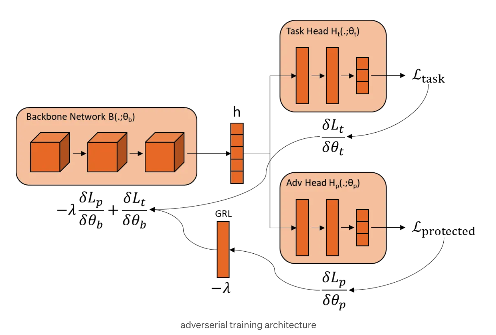
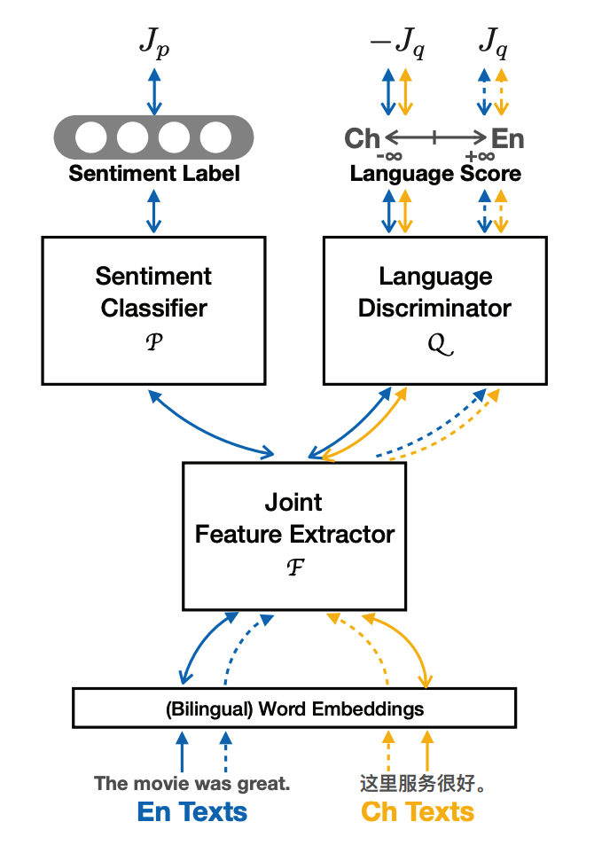
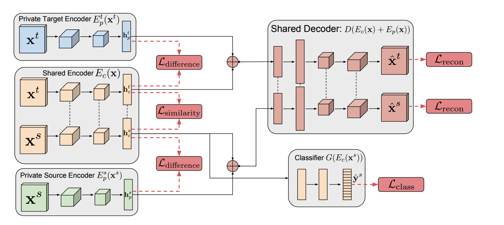

# Adversarial Training for Low-Resource Languages (LRLs)

## Literature Review

### [Adversarial Training for LRLs](https://medium.com/@lukas.hauzenberger/adverserial-training-5bb5ea919ae7) (Lukas Hauzenberger)
Fine-tuning a model while controlling for a specific attribute can significantly enhance its robustness. The approach involves:

1. **Adversarial Head with Gradient Reversal Layer (GRL):**
   - Predicts the languages to _hypothetically_ minimize the influence of a higher-resource language on the low-resource language results.
   - Model is discouraged to correctly predict language by the gradients flowing back from an adversarial head being reversed.
   - Adjusts the magnitude of the gradients using an alpha parameter.
   - Fine-tunes the model, controlling for specific attributes and increasing its robustness against adversarial examples.

2. **Adversarial Head Goal:**
   - Achieve 50% accuracy to ensure no extra information is contained in the model.

### [Unsupervised Language Adaptation](https://aclanthology.org/D19-6102.pdf) (Rocha and Cardoso, 2019)
Adversarial training in a cross-lingual setting aims to make the neural network agnostic to the input language while addressing specific tasks. Key components include:

1. **Components:**
   - Feature Extractor - multilingual backbone model such as mBERT or XLM-R
   - Task Classifier
   - Language Discriminator

2. **Training with GRL:**
   - GRL is used as presented in [Unsupervised Domain Adaptation by Backpropagation](https://arxiv.org/abs/1409.7495) by Ganin and Lempitsky (2015).
   - The goal is to minimize both the task classifier and adversarial component losses.
   - However, training a neural network with GRL is very unstable.

3. **Alternative Approach:**
   - Chen et al. (2018) in [Adversarial Deep Averaging Networks for Cross-Lingual Sentiment Classification](https://aclanthology.org/Q18-1039/) propose minimizing the Wasserstein distance between the distribution of joint hidden features for source and target instances (bilingual examples).
   - Alpha regularizes the adversarial component, increasing its importance over time.

4. **Shared and Private Architecture:**
   - Key Idea: Obtain two different representations of the input.
   - Shared space captures language-agnostic features.
   - Private space captures language-specific features.
   - To prevent interference between shared and private spaces, adversarial training and orthogonality constraints are used.

   Components:
   - Shared and private feature extractors
   - Task classifier (uses shared feature extractor)
   - Language discriminator (uses private feature extractor)
   - Final loss includes task loss, language loss, difference loss (between shared and private representations), and similarity loss (between shared and private representations).

The Shared Private architecture is introduced in [Adversarial Multi-Task Learning for Text Classification](https://aclanthology.org/P17-1001.pdf) by Liu et al. (2017).

## Preliminary Experiments with Sentiment Classification

### Two Low-Resource Languages Setting

| Language | mBERT (single) | mBERT (double) | mBERT (adversarial) |
| -------- | -------------- | -------------- | ------------------- |
| Maltese  | 0.58±0.1 | 0.63±0.05 | 0.64±0.03 |
| Uyghur   | 0.77±0.04 | 0.75±0.07 | 0.81±0.02 |

### Six Low-Resource Languages

| Language | mBERT (single) | mBERT (multiple) | mBERT (adversarial) |
| -------- | -------------- | ---------------- | ------------------- |
| Maltese  | 0.58±0.10 | 0.62±0.01 | 0.65±0.02 |
| Uyghur   | 0.77±0.04 | 0.69±0.03 | 0.72±0.08 |
| Nepali   | 0.63±0.04 | 0.63±0.05 | 0.64±0.03 |
| Sundanese| 0.83±0.01 | 0.81±0.01 | 0.83±0.01 |
| Amharic  | 0.60±0.01 | 0.60±0.01 | 0.60±0.02 |
| Swahili  | 0.49±0.06 | 0.65±0.02 | 0.59±0.04 |

### Dataset and Hyperparameters

- **Dataset Sizes:**
  - Train: 5574
  - Validation: 1064
  - Test: 1716

- **Hyperparameters:**
  - Learning rate for model: 1e-5
  - Learning rate for sentiment analysis head: 1e-5
  - Learning rate for language head model: 8e-5 (5 heads averaging the resulting loss, aiming for F1 score of 50%)
  - Lambda: 1.0
  - 25 epochs max, saving the best model according to F1 score.

- **Training Observations:**
  - Training both sentiment analysis and language heads simultaneously is challenging.
  - Language head typically does not exceed 25% F1 score.

- **Results:**
  - Averaged over 5 independent runs with different seeds.
  - Statistically significant results are indicated by ** one-tailored pair-wise T-test with p-value of 0.05 (AT results compared with all others).

### Summary

This study explores the effectiveness of adversarial training in improving the performance of sentiment classification models for low-resource languages. The experiments demonstrate the potential of adversarial training to enhance model robustness and reduce the influence of high-resource languages on low-resource language results. The Shared Private architecture and the use of gradient reversal layers are key techniques in achieving these improvements.
